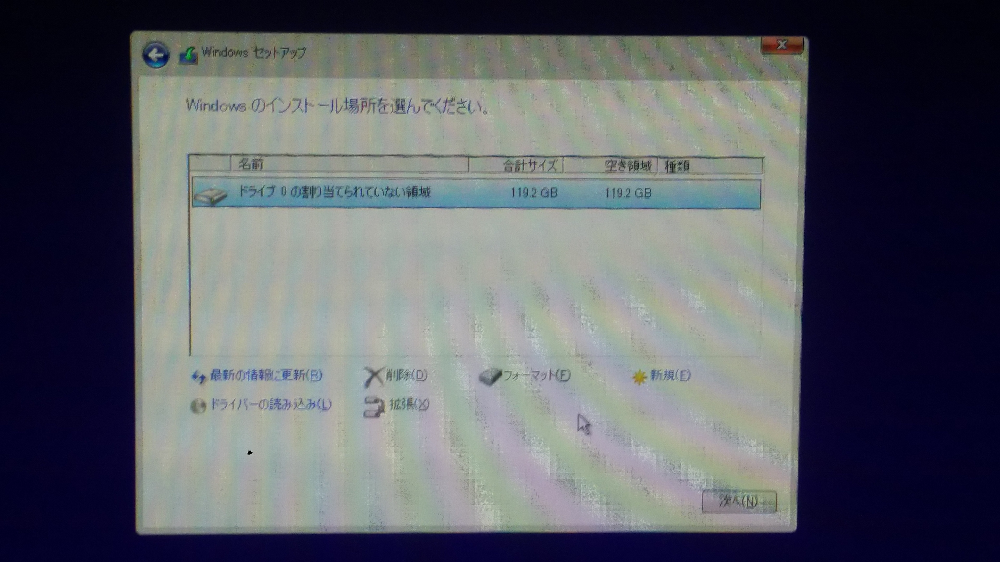

# Windows インストールマニュアル for Cマシン

## 0. 作業の流れと解説

※ まだ電源を入れないでください。
この作業は

1. BIOS の設定
2. Windows インストール
3. TAアカウントの作成
4. 受講者アカウントの作成と管理者権限の付与

の4段階に分かれます。

## 1. BIOS の設定
※ 電源はまだです！

コンピューターの電源を入れるとまずは OS（operating system）などの基本的なソフトウェアをメモリに展開し、各種アプリケーションが使える状態にしなければなりません。通常それは BIOS （バイオス、Basic Input/Output System）により自動的に行われますが、今回は USB メモリからそれを行いたいので、BIOS の設定を変えて起動します。以下そのやり方を記述します。

### USB メモリをいれる
TA の配布する USB メモリに Windows が入っているので、それを USB ポートに挿してください。差込口が青いものと白いものが両方あるので、青い方に挿し込むと良いと思います。

### BIOS の設定画面を出す
コンピューターの電源を入れてから windows が起動するまでに特定のキーを押すと何かが起こります。どのキーを押すと何が起こるのかはコンピューターに寄って異なります。通常は説明書書いてあったり、起動画面の端に小さく書いてあったりします。本講義で使うPCの場合は、いずれも Delete で BIOS 設定画面です。

※ お待ちかね。スイッチオンです！

- コンピューターの電源を入れて、すぐに Delete キーを連打しましょう。

タイミングが割とシビアなのでちゃんと連打しましょう。すると見慣れない画面に遷移するはずです。それが BIOS の設定画面です。なお Windows のログイン画面が出たら連打ゲー失敗なので、一度シャットダウンしてやり直してください。

<!--- 画面の写真を貼るところから--->

### BIOS の設定をする
表示言語はおそらく英語か日本語になっていると思います。どちらでも問題ないのですが、変えるには左上の「English」とか書いてある部分をクリックしてプルダウンメニューで選べば大丈夫です。ここで触るのは次の3つです。

- OS Type
- Secure boot key
- Boot priority

#### OS Types
windows は boot するときに、UEFI（Unified Extensible Firmware Interface）を用いることを義務付けているので、従います。まずは BIOS 設定画面を Advanced mode にしましょう。

- 画面右下の「Advanced」とある部分をクリックするか、F7を押しましょう
- 「起動」（Boot）タブをクリック
- 「セキュアブートメニュー」(Secure Boot) をクリックし
- 「OS タイプ」（OS Types）とあるところを「UEFI モード」（Windows UEFI mode）にしましょう。

#### Secure key
- 「セキュアブートメニュー」にいると思うので、「セキュアブートキーの削除」（Clear Secure Boot Key）をクリック＆Yesします
- 「セキュアブートキーの初期化」（Initial Default Secure Boot Keys）もクリック＆Yesしてください。

#### Boot priority
今からディスクの起動優先度を指定します。初めの画面の右下の方に、Boot priorityと書かれたところがあると思いますす。

- 「起動優先度」（Boot priority）のリストに於いて、「UEFI:SanDisk Extreme」をマウスドラックで一番上にします。初めからそうなっていれば何もしなくて大丈夫です。

これで BIOS の設定は終わりです。

### Boot する
これからこの画面を保存して閉じ、windows install を始めましょう。

- 「退出」（Exit）タブをクリック
- 「保存して退出」（Save Change & Exit）を押します。

すると自動的に windows install 開始画面に遷移します。少し時間が掛かります。
## 2. Windows Install[B, C]

windows をインストールします。この節では、画面遷移ごとに
### この大きさの見出し
で記していきます。

### Windows セットアップ ~ 田Windows [共通]
まず, 「インストールする言語」「時刻と通貨の形式」「キーボードまたは入力方式」「キーボードの種類」の設定を求められるので, 以下の値に設定することを標準とします。（デフォルト値になっているので、変更する必要はないはずです。）

- インストールする言語: 日本語 (日本)
- 時刻と通貨の形式: 日本語 (日本)
- キーボードまたは入力形式: Microsoft IME
- キーボードの種類: 日本語キーボード(106/109キー)  [Keyboard Type: Japanese Keyboard(106/109 Key)]

キーボードの種類以外の値は、好きに設定して構いませんが、日本語が扱えないと困るかもしれませんし、日本語英語以外にされるとTAが対応できない可能性があります。  
キーボードの種類を変えてしまうと、キートップの印字通りの文字が打てなくなってしまいます。

設定したら, 「次へ」をクリックしましょう。

### 今すぐインストール ~ 田Windows [共通]
ウインドウが遷移しますので、「今すぐインストール」をクリックしましょう。

### Windows セットアップ ~ Windowsのライセンス認証[共通]
プロダクトキーの入力を求められますので、お手元のUSBメモリに貼付してあるシールに記載してある、英数字20桁のプロダクトキーを入力しましょう。入力はすべて大文字か数字となり、 ハイフンは自動で入力されます。間違えても弾かれるよう、誤り訂正がかかっています。
もし、何度かやってみてもダメなようでしたら、RAの土屋を呼んでください。

プロダクトキーを入力したら、「次へ」をクリックします。

### Windows セットアップ ~ 適用される通知とライセンス条項[共通]
__ライセンスをよく読み、同意したら、__ 同意しますにチェックを入れ、「次へ」をクリックします。

### Windows セットアップ ~ インストールの種類を選んでください
今回は既存の環境を全部消して、新しくWindowsをインストールするので、「カスタム」をクリックします。  
（アップグレードは既存のWindowsを活かす感じのオプションです。普通（RA基準）は使いません。）
### Windows セットアップ ~ Windowsのインストール場所を選んでください。

#### パーティション設定[B, Cのみ]
B、Cマシンでは、昨年度の実習の環境が残っています。これを上書きしてインストールするために、
ドライブ 0 の割り当てられていない領域 __以外__ のパーティションをすべて __削除__ します。
 ~~他人が使ったパソコンのデータ全部吹っ飛ばすのって気持ちがいいよね☆~~  
 下の写真の状況になったらOKです (容量は環境により異なります)。次へをクリックします。
 

インストールが始まり、自動的に再起動されます。少し時間が掛かります。

## 3. インストール後半戦, TAアカウント作成[共通]
この節でも、画面遷移ごと
### この大きさの見出し
で書いていきます.
基本的には windows くんに言われるとおりにやればよいのですが、一つイレギュラーなこととして

※ 初めはTA用のアカウントを作ります

ので注意しましょう。
### お住いの地域はこちらでよろしいですか？
地域設定を聞かれます。無難に日本を選択し、「はい」を押しましょう。

### キーボード レイアウトはこちらでよろしいですか？
Microsoft IME　が選択されていれば、とくに問題ないはずです。

### 2つめのキーボード レイアウトを追加しますか？
あとから追加できるので、「スキップ」を選択しましょう。

### ネットワークの設定が自動で確認されます。

### アカウント ~ 設定する方法を指定してください。
個人用に設定を選択肢、次へをクリックしたら、__TAを呼んでください__。TAアカウントを作成します。

### TA担当分の画面は省きます。
<!--- このがめんです --->
### Cortanaをパーソナルアシスタントとして指定しますか？
いいえ。
### アクティビティの履歴を利用してデバイス間でより多くのことを行う
いいえ。
### デバイスのプライバシー設定の選択
すべてオフ（スライダが左側）にして、同意。

これで Windows のインストールが終了しました。 Windows が立ち上がったら TA を呼んで TA アカウントにログインしてください。

## 4. 受講者用アカウントの設定[共通]
さて, みなさんのアカウントを作成しましょう. 

- 「スタートメニュー」（左下のWindowsロゴをクリック）を開いてください。
- 歯車のアイコンをクリックしてください。
- 設定ウィンドウが出てきたら「アカウント」を選択してください。
- 設定ウィンドウ左側メニューより、「家族とその他のユーザー」を選択し、その右隣「その他のユーザーをこの PC に追加」を選択します。
- 「このユーザーのサインイン情報がありません」→「Microsoft アカウントを持たないユーザーを追加する」を選択します。
- 「この PC 用のアカウントの作成」が出てきたら、受講生用アカウントを作成します。ユーザー名は半角英数字で入力し、空白は含めないようにしてください。パスワードは他人には破られにくく自分では間違えないパスワードを設定しましょう。
- まず、今作成したアカウントをクリックすると出てくる「アカウントの種類の変更」をクリックしましょう。
    
- 「アカウントの種類」を「管理者」に変更して「OK」をクリックします。
    - この画面でOKを押せば大丈夫です。

    

- TAのアカウントはログアウトし、今作成した受講生用のアカウントにログインしてください。

終わりです。

