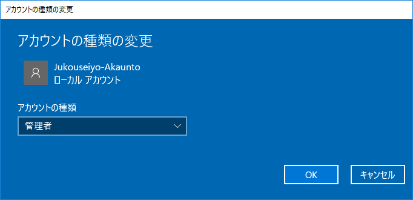

## 3. インストール後半戦, TAアカウント作成[共通]
この節でも、画面遷移ごと
### この大きさの見出し
で書いていきます.
基本的には windows くんに言われるとおりにやればよいのですが、一つイレギュラーなこととして

※ 初めはTA用のアカウントを作ります

ので注意しましょう。
### お住いの地域はこちらでよろしいですか？
地域設定を聞かれます。無難に日本を選択し、「はい」を押しましょう。

### キーボード レイアウトはこちらでよろしいですか？
Microsoft IME　が選択されていれば、とくに問題ないはずです。

### 2つめのキーボード レイアウトを追加しますか？
あとから追加できるので、「スキップ」を選択しましょう。

### ネットワークの設定が自動で確認されます。

### アカウント ~ 設定する方法を指定してください。
個人用に設定を選択肢、次へをクリックしたら、__TAを呼んでください__。TAアカウントを作成します。

### TA担当分の画面は省きます。
<!--- このがめんです --->
### Cortanaをパーソナルアシスタントとして指定しますか？
いいえ。
### アクティビティの履歴を利用してデバイス間でより多くのことを行う
いいえ。
### デバイスのプライバシー設定の選択
すべてオフ（スライダが左側）にして、同意。

これで Windows のインストールが終了しました。 Windows が立ち上がったら TA を呼んで TA アカウントにログインしてください。

## 4. 受講者用アカウントの設定[共通]
さて, みなさんのアカウントを作成しましょう. 

- 「スタートメニュー」（左下のWindowsロゴをクリック）を開いてください。
- 歯車のアイコンをクリックしてください。
- 設定ウィンドウが出てきたら「アカウント」を選択してください。
- 設定ウィンドウ左側メニューより、「家族とその他のユーザー」を選択し、その右隣「その他のユーザーをこの PC に追加」を選択します。
- 「このユーザーのサインイン情報がありません」→「Microsoft アカウントを持たないユーザーを追加する」を選択します。
- 「この PC 用のアカウントの作成」が出てきたら、受講生用アカウントを作成します。ユーザー名は半角英数字で入力し、空白は含めないようにしてください。パスワードは他人には破られにくく自分では間違えないパスワードを設定しましょう。
- まず、今作成したアカウントをクリックすると出てくる「アカウントの種類の変更」をクリックしましょう。
    
- 「アカウントの種類」を「管理者」に変更して「OK」をクリックします。
    - この画面でOKを押せば大丈夫です。
    
- TAのアカウントはログアウトし、今作成した受講生用のアカウントにログインしてください。

終わりです。

