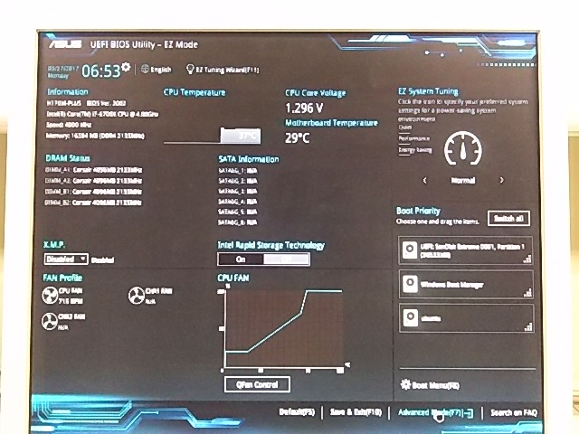

<!--- 画面の写真を貼るところから--->

### BIOS の設定をする
表示言語はおそらく英語か日本語になっていると思います。どちらでも問題ないのですが、変えるには左上の「English」とか書いてある部分をクリックしてプルダウンメニューで選べば大丈夫です。ここで触るのは次の3つです。

- OS Type
- Secure boot key
- Boot priority

#### OS Types
windows は boot するときに、UEFI（Unified Extensible Firmware Interface）を用いることを義務付けているので、従います。まずは BIOS 設定画面を Advanced mode にしましょう。

- 画面右下の「Advanced」とある部分をクリックするか、F7を押しましょう
- 「起動」（Boot）タブをクリック
- 「セキュアブートメニュー」(Secure Boot) をクリックし
- 「OS タイプ」（OS Types）とあるところを「Windows UEFI モード」（Windows UEFI mode）にしましょう。

#### Secure key
- 「セキュアブートメニュー」にいると思うので、「セキュアブートキーの削除」（Clear Secure Boot Key）をクリック＆Yesします
- 「セキュアブートキーの初期化」（Initial Default Secure Boot Keys）もクリック＆Yesしてください。

これで BIOS の設定は終わりです。

#### Boot priority
今からディスクの起動優先度を指定します。初めの画面の右下の方に、Boot priorityと書かれたところがあると思いますす。

- 「起動優先度」（Boot priority）のリストに於いて、「UEFI:SanDisk Extreme」をマウスドラックで一番上にします。初めからそうなっていれば何もしなくて大丈夫です。

### Boot する
これからこの画面を保存して閉じ、windows install を始めましょう。

- 「退出」（Exit）タブをクリック
- 「保存して退出」（Save Change & Exit）を押します。

すると自動的に windows install 開始画面に遷移します。少し時間が掛かります。
